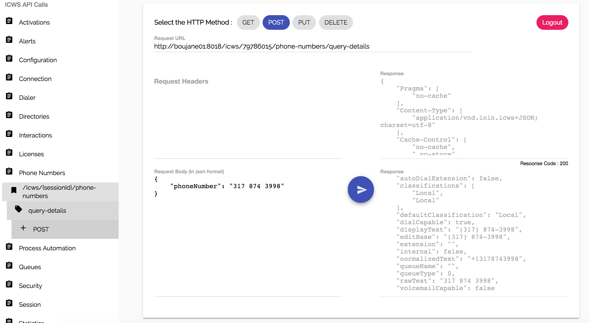

# Summary

This is a browser based application that allows for testing calls to [the RESTful ICWS api](https://help.inin.com/developer/cic/docs/icws/webhelp/ConceptualContent/Welcome.htm#top).
It is developped in [Angular 2](https://www.angular.io) 

# Example

Upon accessing the web app, you will see this login screen. After a successful login, you will be able to navigate the existing calls to then pre-populate the request body + headers + url, modify them and send the request:

## Curious how I got the ICWS api calls data?

The data was retrieved directly from the [documentation website](https://help.inin.com/developer/cic/docs/icws/webhelp/ConceptualContent/Welcome.htm#top) by parsing each and every HTML page. The relevant data was then extracted using a python script - [here](https://github.com/a-boujane/icws-js/tree/master/get-api-data)

